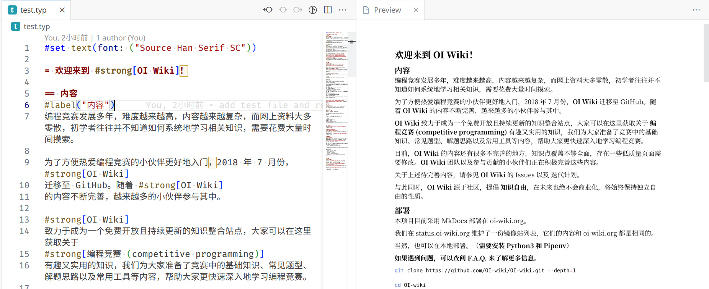

# typst-preview README

Preview your Typst files in vscode instantly

Install this extension from [marketplace](https://marketplace.visualstudio.com/items?itemName=mgt19937.typst-preview), open command palette (Ctrl+Shift+P), and type `>Typst Preview:`.



https://user-images.githubusercontent.com/25521218/230921917-e535340e-a535-44c3-964b-d33bc0b0cc88.mp4

## Requirements

Please install [typst-ws](https://github.com/Enter-tainer/typst-ws) first.

You can install from source using cargo:

```bash
cargo install --git https://github.com/Enter-tainer/typst-ws
```

Or you can download [prebuilt binary](https://nightly.link/Enter-tainer/typst-ws/workflows/build/master) for your platform, rename it to `typst-ws`, and put it in your `PATH`.
## Extension Settings

TODO
## Known Issues

- Ctrl+wheel is kind of strange
- Render output mayby kind of blurry

## Acknowledgements

Big thanks to @zzh1996 for graciously granting me access to the GPT-4 API. Thanks to his generosity, I was able to complete this extension in such a short time.

(Yes, the javascript part is mostly done by GPT)
## Release Notes

### 0.1.0

Initial release 

### 0.1.6

Add preview button

### 0.1.7

- Preview on type
- Add config entry for `typst-ws` path
